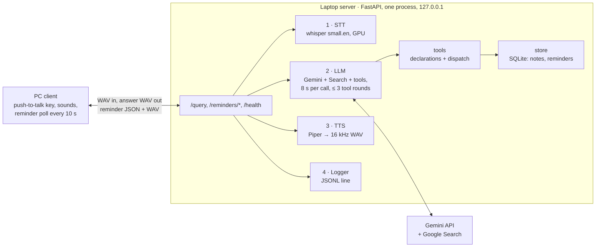

Version 1. See roadmap.md.

# AI Assistant v1 Design: Voice assistant

Updated Oct 9, 2026 · Bhavik Fulfagar

One FastAPI process on the laptop runs speech-to-text and text-to-speech locally, calls Gemini for the answer, and keeps notes and reminders in SQLite. A push-to-talk Python client on the same laptop calls it. Requirements are in spec.md.

## Architecture

The `/query` handler is the only place that knows the order of the stages; each stage is a small module, so any of them can be swapped without touching the others.



| Block | Job |
| --- | --- |
| PC client | One push-to-talk key; plays start, thinking and error sounds; sends the WAV and plays the answer. Every 10 s, when idle, polls `/reminders/due`, prints each reminder, plays its audio and acks it. |
| main.py | Validates uploads, runs the stages in order, times each one, returns the WAV or an error. Serves the reminder endpoints and `/health`. |
| STT (`stt.py`) | Question WAV → text with faster-whisper `small.en`, loaded once at startup. |
| LLM (`llm.py`) | Sends the question to Gemini with the system instruction, Google Search and the tool declarations; runs the tool-call loop through `tools`; returns the answer, whether Gemini searched, and the tool calls made. |
| Tools (`tools.py`) | The five function declarations, a dispatcher that runs a call against `store` and always returns a result dict (errors included), and the spoken reminder text ("Reminder, 5 pm: …" / "Missed reminder, …"). |
| Store (`store.py`) | SQLite access: create tables, add and list notes, add, list, cancel, list due and ack reminders. |
| TTS (`tts.py`) | Answer text → speech with Piper, resampled to 16 kHz mono 16-bit. |
| Logger (`logger.py`) | One JSONL line per query, failed ones included. |
| Gemini API | The only part that needs the internet. |

## Search and tools in one request

Current Gemini docs (https://ai.google.dev/gemini-api/docs/generate-content/tool-combination, updated 2026-10-05) say built-in tools such as Google Search and function calling can be combined in one request. The feature is in Preview and works on Gemini 3 models only, so v1 uses a Gemini 3 Flash model; Flash-Lite is not listed and is not used.

- Every request carries the `google_search` tool and the five function declarations.
- `include_server_side_tool_invocations` is set to true and function calling uses `VALIDATED` mode (`AUTO` is not supported with the flag).
- When Gemini returns function calls, the server runs them and sends back all response parts unchanged (including `id`, `tool_type` and `thought_signature`) plus the results, up to 3 rounds.
- The docs warn that conflicting time or location information in the system instruction can make the combination work poorly. The instruction states only the real current time and the home city; the eval checks live questions and relative times together.
- SDK details (parameter names, grounding metadata, timeout units, thinking setting) change between versions: check the current `google-genai` docs before writing `llm.py`.

System instruction (a constant in `llm.py`, with values filled in per request):

- Current date, weekday and time in the configured time zone (Asia/Kolkata); home city for weather.
- Answer in at most 2 short sentences, under 40 words; lists of notes or reminders may be longer and give each reminder's date and time.
- Use Google Search when a question needs live information.
- Use the tools for notes and reminders; turn relative times into an exact ISO 8601 time with offset.
- After any action, repeat it back with the stored values; on a tool error, say what went wrong.

## Storage

One SQLite file at `data/assistant.db` (path in config, gitignored), opened by `store.py`; tables are created at startup.

| Table | Columns |
| --- | --- |
| notes | id, text, created_at |
| reminders | id, text, due_at, created_at, status (pending, delivered, cancelled) |

Times are stored as ISO 8601 strings with the configured offset. A reminder is due when `status = pending` and `due_at ≤ now`; only `POST /reminders/{id}/ack` sets `delivered`, so a reminder survives a client crash. It is "missed" when it was due 60 s or more before the audio is fetched (threshold in config).

## Tech stack

Everything is Python. Only the Gemini call leaves the laptop.

| Part | Choice | Why |
| --- | --- | --- |
| Server | Python 3.11, FastAPI + Uvicorn, bound to 127.0.0.1 | Clean file uploads; the `/docs` page tests endpoints from a browser; no other device can reach it |
| STT | faster-whisper `small.en` on CUDA, float16 | Fast on the RTX 4050; English-only model is more accurate for English |
| LLM | A Gemini 3 Flash model through the `google-genai` SDK; minimal thinking, 8 s timeout per call | Search and function calling in one request; no GPU needed |
| Storage | SQLite through Python's `sqlite3` | No server, one local file |
| Time | `zoneinfo` with the configured time zone | Exact times for "tomorrow at 5"; Windows needs the `tzdata` package for zone data |
| TTS | Piper (`piper-tts`) with one English voice | Fast and offline; resampled to 16 kHz mono |
| Client | sounddevice (mic and playback), pynput (push-to-talk key), requests | Small and cross-platform |
| Config | `.env` for `GEMINI_API_KEY`; `server/config.py` and `client_pc/config.py` for host, port, model, timeouts, time zone, home city, poll interval, database path | The key never enters git |
| Tests | pytest with fakes; `run_eval.py` for the 30 eval questions | One command reruns the evaluation |

## Timeouts and errors

Each timeout is shorter than the one above it, so the layer that knows what went wrong reports it.

| Layer | Timeout | On failure |
| --- | --- | --- |
| Gemini call | 8 s per call, at most 3 tool rounds | Raises an error naming the `llm` stage |
| Tool call | none (local SQLite) | Returns `{"error": ...}` to Gemini; never raises |
| Server `/query` | none of its own; stages are bounded | 400 for bad audio, 500 `"<stage>: <reason>"` for a failed stage; the server keeps running |
| Client query | 20 s | Error sound; ready for the next key press |
| Client reminder poll | same 20 s | Skipped silently; retried at the next poll, the reminder stays due |

## Repo structure

One file per block, so each task touches as few files as possible.

```text
ai-glasses/
├── CLAUDE.md  README.md  requirements.txt  .env.example  .gitignore
├── docs/
│   ├── roadmap.md        # final goal and versions v1–v5
│   ├── brief.md  spec.md  design.md  plan.md   # current version (v1)
│   ├── hardware_plan.md  # parts and wiring, for v5
│   └── archive/          # vN/ copies of finished versions' docs
├── server/
│   ├── main.py           # FastAPI app: /query, /reminders/*, /health; stage order
│   ├── config.py         # all server settings; reads .env
│   ├── stt.py            # faster-whisper
│   ├── llm.py            # Gemini + Search + tool-call loop + system instruction
│   ├── tools.py          # tool declarations, dispatch, spoken reminder text
│   ├── store.py          # SQLite: notes and reminders
│   ├── tts.py            # Piper + resample to 16 kHz
│   └── logger.py         # JSONL line
├── client_pc/
│   ├── client.py         # push-to-talk, sounds, reminder polling
│   └── config.py         # server address, key, timeouts, poll interval
├── tests/
│   ├── conftest.py       # fakes and a temporary database
│   ├── test_server.py    # endpoint tests
│   ├── test_<module>.py  # one module's own logic
│   ├── questions.csv     # frozen 30-question eval set
│   └── run_eval.py       # accuracy + latency
├── data/                 # assistant.db, gitignored
├── models/               # Piper voice files, gitignored
└── logs/                 # queries.jsonl, gitignored
```

## Key decisions

| Decision | Chosen | Instead of | Why |
| --- | --- | --- | --- |
| Live info and tools | Google Search and function calling in one Gemini request | A separate `web_search` function making its own grounded call | The current docs support the combination on Gemini 3 models; one call path, fewer calls |
| Server shape | One process, models loaded at startup | Separate services per stage | Loading whisper per request costs seconds; one process is simplest to debug |
| Transport | One HTTP POST per question, complete WAV answer | Streaming | Matches push-to-talk; reused by later clients |
| Reminder delivery | Client polls `/reminders/due`, fetches audio, then acks | Server push, or marking delivered when listed | Simple over HTTP; no reminder is lost if the client dies before playing it; v2's phone app reuses the same endpoints and shows the text |
| Storage | SQLite file on the laptop | A hosted database | Private, no setup, enough for one user |
| Network | 127.0.0.1 only | Listening on Wi-Fi | No auth needed until v2 adds `AUTH_TOKEN` |
| Audio format | 16 kHz mono 16-bit everywhere | Each tool's own rate | One format for every client, including later hardware |

## Risks and mitigations

| Risk | Mitigation |
| --- | --- |
| Search + tool combination is Preview and may change | Pin the SDK version; stage timings and the `searched` flag in the log show regressions; the eval covers both live and tool questions |
| Time in the system instruction confuses the search tool | Only the real current time and home city in the instruction; check relative-time and live questions together in the eval |
| Gemini picks the wrong tool or a wrong time | `VALIDATED` mode, clear declarations, actions repeated back so mistakes are heard; the eval measures it per group |
| Two Gemini calls per tool command push latency past 15 s | Stage timings in the log; minimal thinking; 8 s timeout per call |
| Free-tier rate limits during the eval | Pace `run_eval.py`; check limits in Google AI Studio |
| A due reminder plays while I am speaking | The client polls only when idle |
