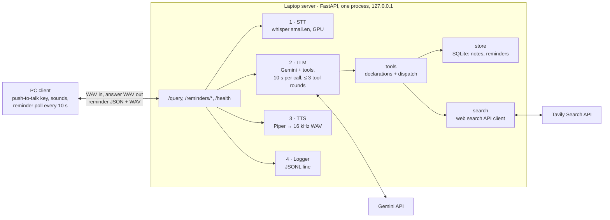

Version 1. See roadmap.md.

# AI Assistant v1 Design: Voice assistant

Updated Oct 9, 2026 · Bhavik Fulfagar

One FastAPI process on the laptop runs speech-to-text and text-to-speech locally, calls Gemini for the answer, and keeps notes and reminders in SQLite. A push-to-talk Python client on the same laptop calls it. Requirements are in spec.md.

## Architecture

The `/query` handler is the only place that knows the order of the stages; each stage is a small module, so any of them can be swapped without touching the others.



| Block | Job |
| --- | --- |
| PC client | One push-to-talk key; plays start, thinking and error sounds; sends the WAV and plays the answer. Every 10 s, when idle, polls `/reminders/due`, prints each reminder, plays its audio and acks it. |
| main.py | Validates uploads, runs the stages in order, times each one, returns the WAV or an error. Serves the reminder endpoints and `/health`. |
| STT (`stt.py`) | Question WAV → text with faster-whisper `small.en`, loaded once at startup. |
| LLM (`llm.py`) | Sends the question to Gemini with the system instruction and the tool declarations; runs the tool-call loop through `tools`; returns the answer, whether `web_search` ran, and the tool calls made. |
| Tools (`tools.py`) | The six function declarations, a dispatcher that runs a call against `search` or `store` and always returns a result dict (errors included), and the spoken reminder text ("Reminder, 5 pm: …" / "Missed reminder, …"). |
| Search (`search.py`) | Query → top web results (title, URL, content) from the Tavily Search API; raises on failure so `tools` turns it into an error result. |
| Store (`store.py`) | SQLite access: create tables, add and list notes, add, list, cancel, list due and ack reminders. |
| TTS (`tts.py`) | Answer text → speech with Piper, resampled to 16 kHz mono 16-bit. |
| Logger (`logger.py`) | One JSONL line per query, failed ones included. |
| Gemini API, Tavily Search API | The only parts that need the internet. |

## Live search through a `web_search` tool

The M3 spike (Oct 10, 2026, results in plan.md) showed that Google Search grounding has no API quota on our free tier: every request with the `google_search` tool returned 429, on `gemini-3.8-flash`, `gemini-3.7-flash` and `gemini-3.5-flash-lite`. On `gemini-3.5-flash-lite` with our key, plain calls and function calling work. So Gemini never searches itself; the server searches for it.

- Model: `gemini-3.5-flash-lite` (free tier: 15 requests per minute, 500 per day). Timeout 10 s per call, the minimum the API accepts (8 s is rejected).
- Every request carries the function declarations, with no built-in tools: `web_search(query)` plus the five notes and reminder tools (added in M5). Function calling uses `VALIDATED` mode.
- When Gemini calls `web_search`, `tools` passes the query to `search.py`, which calls the Tavily Search API (basic depth, a few top results, timeout from config). The results go back to Gemini as `{results: [{title, url, content}]}`; a failure goes back as `{error}`. Gemini then answers from them.
- `searched` is true when `web_search` ran and returned results.
- When Gemini returns function calls, the server runs them and sends back all response parts unchanged (including `id` and `thought_signature`) plus the results, up to 3 rounds. A live question costs two Gemini calls and one search call.
- Deadline: the LLM stage has a 15 s deadline (`LLM_DEADLINE_S`). Before each Gemini or search call, `llm` checks that the call's full timeout fits in the time left; if not, it raises `llm: deadline exceeded`. The worst case (Gemini 10 s + search 5 s + Gemini 10 s = 25 s) would otherwise pass the client's 20 s timeout.
- Privacy rule: `web_search` sends only the search query to Tavily. Never send notes, reminders or (from v3) memory content as a query. Tavily's terms let it use queries and results to improve its models.
- Backup provider: Exa (`exa-py`, $10 free credit a month, no card). Switching changes only `search.py` and its config.
- SDK details (parameter names, timeout units, thinking setting) change between versions: check the current `google-genai` and `tavily-python` docs before writing `llm.py` and `search.py`.

System instruction (a constant in `llm.py`, with values filled in per request):

- Current date, weekday and time in the configured time zone (Asia/Kolkata); home city for weather.
- Answer in at most 2 short sentences, under 40 words; lists of notes or reminders may be longer and give each reminder's date and time.
- Call `web_search` when a question needs live information; put the date or the home city in the query when the question depends on them; never put note or reminder content in a query.
- Use the tools for notes and reminders; turn relative times into an exact ISO 8601 time with offset.
- After any action, repeat it back with the stored values; on a tool error, say what went wrong.

## Storage

One SQLite file at `data/assistant.db` (path in config, gitignored), opened by `store.py`; tables are created at startup.

| Table | Columns |
| --- | --- |
| notes | id, text, created_at |
| reminders | id, text, due_at, created_at, status (pending, delivered, cancelled) |

Times are stored as ISO 8601 strings with the configured offset. A reminder is due when `status = pending` and `due_at ≤ now`; only `POST /reminders/{id}/ack` sets `delivered`, so a reminder survives a client crash. It is "missed" when it was due 60 s or more before the audio is fetched (threshold in config).

## Tech stack

Everything is Python. Only the Gemini and web search calls leave the laptop.

| Part | Choice | Why |
| --- | --- | --- |
| Server | Python 3.11, FastAPI + Uvicorn, bound to 127.0.0.1 | Clean file uploads; the `/docs` page tests endpoints from a browser; no other device can reach it |
| STT | faster-whisper `small.en` on CUDA, float16 | Fast on the RTX 3050 Laptop GPU (4 GB); English-only model is more accurate for English |
| LLM | `gemini-3.5-flash-lite` through the `google-genai` SDK; minimal thinking, 10 s timeout per call | Function calling works on our free tier (15 RPM, 500 RPD); no GPU needed |
| Web search | Tavily Search API through `tavily-python` | Free plan: 1,000 credits a month (basic search = 1 credit), no card; results made for LLM tools |
| Storage | SQLite through Python's `sqlite3` | No server, one local file |
| Time | `zoneinfo` with the configured time zone | Exact times for "tomorrow at 5"; Windows needs the `tzdata` package for zone data |
| TTS | Piper (`piper-tts`) with one English voice | Fast and offline; resampled to 16 kHz mono |
| Client | sounddevice (mic and playback), pynput (push-to-talk key), requests | Small and cross-platform |
| Config | `.env` for `GEMINI_API_KEY` and `TAVILY_API_KEY`; `server/config.py` and `client_pc/config.py` for host, port, model, timeouts, time zone, home city, search result count, poll interval, database path | The keys never enter git |
| Tests | pytest with fakes; `run_eval.py` for the 30 eval questions | One command reruns the evaluation |

## Timeouts and errors

Each timeout is shorter than the one above it, so the layer that knows what went wrong reports it.

| Layer | Timeout | On failure |
| --- | --- | --- |
| LLM stage | 15 s deadline (`LLM_DEADLINE_S`): a Gemini or search call starts only if its full timeout fits in the time left | Raises `llm: deadline exceeded`; keeps STT 1 s + LLM 15 s + TTS 1 s = 17 s under the client's 20 s |
| Gemini call | 10 s per call (API minimum), at most 3 tool rounds | Raises an error naming the `llm` stage |
| Tool call: `web_search` | 5 s | Returns `{"error": ...}` to Gemini; never raises |
| Tool call: notes and reminders | none (local SQLite) | Returns `{"error": ...}` to Gemini; never raises |
| Server `/query` | none of its own; stages are bounded | 400 for bad audio, 500 `"<stage>: <reason>"` for a failed stage; the server keeps running |
| Client query | 20 s | Error sound; ready for the next key press |
| Client reminder poll | same 20 s | Skipped silently; retried at the next poll, the reminder stays due |

## Repo structure

One file per block, so each task touches as few files as possible.

```text
ai-glasses/
├── CLAUDE.md  README.md  requirements.txt  .env.example  .gitignore
├── docs/
│   ├── roadmap.md        # final goal and versions v1–v5
│   ├── brief.md  spec.md  design.md  plan.md   # current version (v1)
│   ├── hardware_plan.md  # parts and wiring, for v5
│   └── archive/          # vN/ copies of finished versions' docs
├── server/
│   ├── main.py           # FastAPI app: /query, /reminders/*, /health; stage order
│   ├── config.py         # all server settings; reads .env
│   ├── stt.py            # faster-whisper
│   ├── llm.py            # Gemini + tool-call loop + system instruction
│   ├── tools.py          # tool declarations, dispatch, spoken reminder text
│   ├── search.py         # Tavily web search for the web_search tool
│   ├── store.py          # SQLite: notes and reminders
│   ├── tts.py            # Piper + resample to 16 kHz
│   └── logger.py         # JSONL line
├── client_pc/
│   ├── client.py         # push-to-talk, sounds, reminder polling
│   └── config.py         # server address, key, timeouts, poll interval
├── tests/
│   ├── conftest.py       # fakes and a temporary database
│   ├── test_server.py    # endpoint tests
│   ├── test_<module>.py  # one module's own logic
│   ├── questions.csv     # frozen 30-question eval set
│   └── run_eval.py       # accuracy + latency
├── data/                 # assistant.db, gitignored
├── models/               # Piper voice files, gitignored
└── logs/                 # queries.jsonl, gitignored
```

## Key decisions

| Decision | Chosen | Instead of | Why |
| --- | --- | --- | --- |
| Live info and tools | A `web_search` function that the server runs against the Tavily Search API | Google Search grounding, alone or combined with function calling | Grounding has no API quota on our free tier (429 in the M3 spike); one tool-call path for search, notes and reminders |
| Server shape | One process, models loaded at startup | Separate services per stage | Loading whisper per request costs seconds; one process is simplest to debug |
| Transport | One HTTP POST per question, complete WAV answer | Streaming | Matches push-to-talk; reused by later clients |
| Reminder delivery | Client polls `/reminders/due`, fetches audio, then acks | Server push, or marking delivered when listed | Simple over HTTP; no reminder is lost if the client dies before playing it; v2's phone app reuses the same endpoints and shows the text |
| Storage | SQLite file on the laptop | A hosted database | Private, no setup, enough for one user |
| Network | 127.0.0.1 only | Listening on Wi-Fi | No auth needed until v2 adds `AUTH_TOKEN` |
| Audio format | 16 kHz mono 16-bit everywhere | Each tool's own rate | One format for every client, including later hardware |

## Risks and mitigations

| Risk | Mitigation |
| --- | --- |
| Free-tier limits: Gemini 15 RPM and 500 RPD; Tavily 1,000 credits a month | Basic search only (1 credit); pace `run_eval.py`; a 429 shows as an `llm` error or a `web_search` error result in the log |
| Gemini answers a live question from memory instead of calling `web_search` | The system instruction says when to search; the `searched` flag in the log shows it; the eval's 10 general and live questions measure it |
| Tavily changes or ends its free plan | `search.py` is the only file that knows the provider; swap it for Exa (the documented backup) without touching `llm` or `tools`. Pin the SDK versions |
| Private content leaks into search queries | Privacy rule: only the search query goes to Tavily, never notes, reminders or memory; the system instruction says so and the log shows every `web_search` query |
| Gemini picks the wrong tool or a wrong time | `VALIDATED` mode, clear declarations, actions repeated back so mistakes are heard; the eval measures it per group |
| Two Gemini calls per live question or tool command push latency past 15 s | Stage timings in the log; minimal thinking; 10 s timeout per call; 5 s search timeout |
| A due reminder plays while I am speaking | The client polls only when idle |
