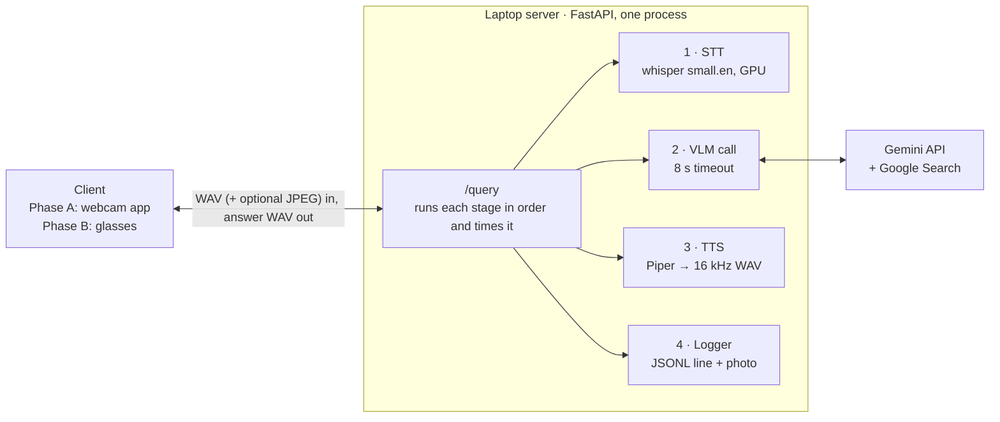

# AI Assistant Glasses — v1 Design

Updated Oct 5, 2026 · Bhavik Fulfagar

One FastAPI process on the laptop runs speech-to-text and text-to-speech locally and calls Gemini for the answer; the webcam client and the glasses call it the same way. Requirements are in spec.md; hardware, wiring and mounting are in expense_v1.md.

## Architecture

The `/query` handler is the only place that knows the order of the stages; each stage is a small module with one function, so any of them can be swapped without touching the others.



| Block | Job |
| --- | --- |
| Client | Has two buttons: Look sends a photo plus the question, Ask sends only the question. Plays a distinct sound for each, then plays the answer. Phase A is a Python webcam app; Phase B is the glasses firmware. |
| /query | Checks the uploaded files (the photo is optional), calls the stages in order, times each one, returns the answer WAV or an error. |
| STT | Turns the question WAV into text with faster-whisper small.en, loaded once at server start. |
| VLM call | Sends the question text, plus the photo when there is one, to Gemini and returns the answer text. The system instruction says: answer in at most 2 short sentences, use the photo only when the question is about what the user sees, and use Google Search when a question needs live information such as weather or news. Search grounding is enabled on every request and Gemini decides when to use it; the home city for weather comes from config. |
| TTS | Turns the answer text into speech with Piper and resamples it to 16 kHz mono. |
| Logger | Writes one JSONL line per query (question, answer, stage timings, whether a photo was sent, any error) and saves the photo if there is one. |
| Gemini API | Google's hosted model; the only part that needs the internet. |

## Tech stack

Everything is Python except the firmware, and only the VLM call leaves the laptop.

| Part | Choice | Why |
| --- | --- | --- |
| Server | Python 3.11, FastAPI + Uvicorn | Handles file uploads cleanly; the auto-generated /docs page lets you test /query from a browser |
| STT | faster-whisper `small.en` on CUDA, float16 | Fast on the RTX 4050; the English-only model is more accurate for English |
| VLM | Gemini Flash or Flash-Lite through the `google-genai` Python SDK | No GPU needed; thinking at its lowest setting and an 8 s timeout keep it fast; the Google Search tool gives live answers |
| TTS | Piper (`piper-tts`) with one English voice | Fast and offline; output resampled to 16 kHz mono so the ESP32 needs no resampling |
| Phase A client | OpenCV (webcam), sounddevice (mic and playback), pynput (two hold-to-talk keys for Look and Ask), requests | Calls /query exactly the way the glasses will |
| Firmware | Arduino core 3.x via arduino-cli; esp32-camera, ESP_I2S, HTTPClient | Builds and flashes from the terminal, so Claude Code can do it; pins in expense_v1.md |
| Config | `.env` for `GEMINI_API_KEY`; `config.py` for port, model names, timeouts and home city | The key never enters git |
| Tests | pytest for the server; `run_eval.py` for the 30-question set (20 visual, 10 audio-only) | One command reruns the whole evaluation |

## Timeouts and errors

Each timeout is shorter than the one above it, so a failure is always caught and reported by the layer that knows what went wrong.

| Layer | Timeout | On failure |
| --- | --- | --- |
| Gemini call | 8 s | Raises an error naming the VLM stage |
| Server /query | No timeout of its own; stages are bounded | Returns 400 if the audio is missing or a file is unreadable, 500 with `"<stage>: <reason>"` otherwise; the server keeps running |
| Client | 20 s | Plays the error tone and is ready for the next press |
| Glasses Wi-Fi | n/a | Reconnects automatically; calls GET /health at boot and plays the error tone until the server answers |

The logger writes a line for failed queries too, with the stage that failed, so every error can be traced afterwards.

## Repo structure

One file per architecture block, so each Claude Code task touches as few files as possible.

```text
ai-glasses/
├── CLAUDE.md            # rules and context Claude Code reads every session
├── README.md            # what it does, diagram, setup, demo video link
├── .env.example         # GEMINI_API_KEY= (the real .env is gitignored)
├── .gitignore           # .env, logs/, model files
├── docs/
│   ├── brief.md         # v1 Brief
│   ├── spec.md          # v1 Spec
│   ├── design.md        # this doc
│   └── expense_v1.md    # Expense for v1
├── server/
│   ├── main.py          # FastAPI app: /query and /health
│   ├── config.py        # port, model names, timeouts
│   ├── stt.py           # faster-whisper wrapper
│   ├── vlm.py           # Gemini call + system instruction
│   ├── tts.py           # Piper + resample to 16 kHz
│   └── logger.py        # JSONL line + saved photo
├── client_pc/
│   └── client.py        # Phase A webcam + mic client
├── firmware/
│   └── glasses/
│       ├── glasses.ino  # 2 buttons, camera, mic, HTTP, sounds
│       └── config.h     # Wi-Fi name, server IP and port (gitignored)
├── tests/
│   ├── questions.csv    # the frozen 30-question set
│   ├── test_server.py   # pytest: /query happy path and bad input
│   └── run_eval.py      # runs both sets, writes accuracy and latency
└── logs/                # query logs and photos (gitignored)
```

## Key design decisions

Each row records what was picked, what was passed over and why, so a later change can check whether the reason still holds.

| Decision | Chosen | Instead of | Why |
| --- | --- | --- | --- |
| Server shape | One process, models loaded at startup | Separate services per stage | Loading whisper per request would cost seconds; one process is simplest to debug |
| Transport | One HTTP POST with the audio and an optional photo | WebSocket streaming | One request and one response matches push-to-talk, and the ESP32's HTTP client handles it |
| Two kinds of question | Two buttons, Look (photo + question) and Ask (question only), sharing /query with an optional photo | One button with double-tap-and-hold | No tap timing to get wrong, and distinct sounds confirm which mode started |
| Live information | One Gemini model with the Google Search tool enabled on every request | A second model, or search only on Ask questions | Gemini decides when to search, so one code path covers both buttons |
| Answer audio | Complete WAV file | Streamed audio | Much simpler firmware, and it fits the 15 s target |
| Audio format | 16 kHz mono 16-bit everywhere | Each tool's own sample rate | One format means the ESP32 never resamples |
| Image | 640×480 JPEG straight from the camera | Larger capture, resized on the server | Smaller upload and no extra step |
| Clients | Phase A and Phase B share /query | A separate endpoint per client | The server is fully tested before the hardware is wired |

## Risks and mitigations

The biggest unknown is Gemini's response time over mobile data, which is why every stage is timed from the first build.

| Risk | Mitigation |
| --- | --- |
| Gemini is slow over the phone's mobile data | Stage timings in the log show it at once; try Flash-Lite; the 8 s timeout plays the error tone instead of hanging |
| Gemini describes the photo when the question has nothing to do with it | The system instruction says to use the photo only when relevant; try a few general questions with a photo attached during Phase A |
| Google Search slows answers or hits its usage limits | The log records when Gemini searched, so its cost in time shows up; check the grounding limits in Google AI Studio |
| Free-tier rate limits during the 30-question run | Pace the evaluation script; check the current limits in Google AI Studio |
| Board runs hot near the face | Heatsink, a gap from the skin, and a touch check after the 30-minute wear test |
| Speaker too quiet in a noisy lab | Amp powered from 5 V; raise the amp gain or scale the samples in firmware |
| Hotspot Wi-Fi drops | Auto-reconnect in firmware and a /health check at boot |
